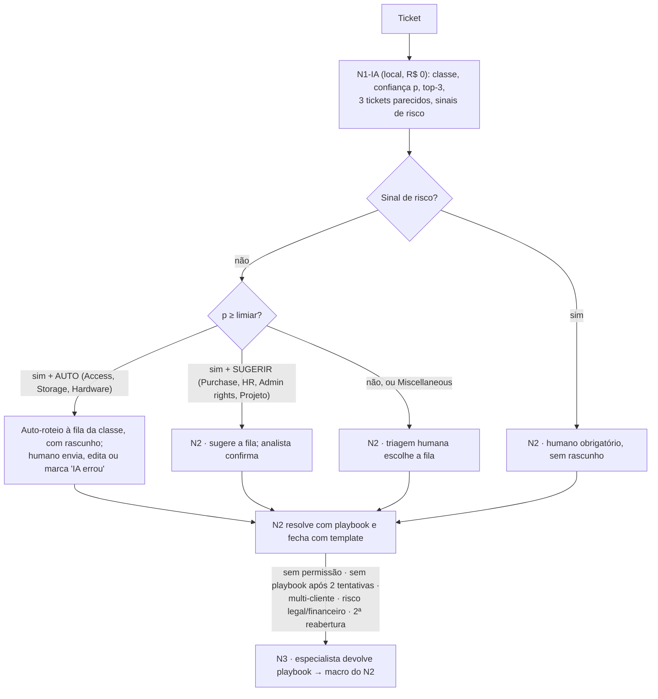

# Proposta — triagem N1-IA → N2 → N3 com gate de confiança

Hugo Cunha · Challenge 002 · 2026-09-16 · Números: `prototipo/artifacts/metrics.json` (hold-out de 9.490 tickets reais do Dataset 2), `policy.json`, `ds1_metrics.json`; premissas rotuladas.

**Tese.** Automatiza-se hoje, com prova, a triagem: um classificador local roteia sozinho os tickets em que a precisão medida é ≥ 97% e devolve o resto a uma pessoa; a resolução assistida por similaridade depende antes do fechamento padronizado. Regra inegociável, no texto e no código: **a IA nunca responde ao cliente nem fecha ticket.**

## 1. O fluxo

## 2. O limiar, em linguagem de gestor

O classificador devolve, por ticket, a probabilidade (calibrada: ECE 0,032) de a classe prevista estar certa; o limiar é a confiança mínima para a IA agir sozinha (`thresholds`; `prototipo/artifacts/figures/coverage_accuracy.png`):

| Limiar | Cobertura bruta | Acerto bruto | Cobertura útil | Acerto útil | Erros úteis | Tickets/mês auto-roteados* |
|---:|---:|---:|---:|---:|---:|---:|
| 0,80 | 66,2% | 96,7% | 32,9% | 96,2% | 120 em 3.124 | ~820 (~32 erros) |
| **0,90** | 53,9% | 98,3% | **26,5%** | **98,2%** | **45 em 2.511** | ~660 (~12 erros) |
| 0,95 | 43,9% | 99,0% | 20,9% | 98,8% | 23 em 1.983 | ~520 (~6 erros) |

"Útil" = p ≥ limiar **e** classe auto-roteável **e** sem sinal de risco (1,1% do hold-out tem sinal). \*Premissa: 2.500 tickets/mês (30.000/ano do brief). Recomendação: piloto em **0,90**; afrouxar para 0,80 depois do modo sombra se "IA errou" ficar abaixo do re-roteamento humano atual. O limiar não muda o terço dos tickets (33,8%, p < 0,80) que acerta só 66,6% e é humano em qualquer cenário.

## 3. Política por classe

Cobertura e acerto a 0,90 dentro de cada classe prevista (`per_class_at["0.90"]`), volume após desduplicação (`class_counts`), ação e motivo (`policy.json`).

| Classe (volume) | Cobertura a 0,90 | Acerto | Ação | Motivo |
|---|---:|---:|---|---|
| Access (7.102) | 65,2% | 98,7% | auto-roteio com rascunho | pedido repetitivo e de alta precisão; rotear não concede acesso |
| Storage (2.773) | 64,2% | 99,4% | auto-roteio com rascunho | melhor precisão entre as classes auto-roteáveis; aumento de cota é decisão do N2 |
| Hardware (13.574) | 45,3% | 97,5% | auto-roteio com rascunho | troubleshooting padronizável; classe que absorve confusões, primeira a ter kill switch |
| Purchase (2.308) | 85,5% | 99,5% | sugerir fila | envolve dinheiro e aprovação: N2 confirma a fila |
| HR Support (10.800) | 54,5% | 98,6% | sugerir fila | envolve pessoas: nunca rascunho automático |
| Administrative rights (1.759) | 43,2% | 99,1% | sugerir fila | elevação de privilégio é segurança e o modelo erra 31% da classe |
| Internal Project (2.105) | 62,8% | 98,7% | sugerir fila | não é suporte; vai ao PMO com confirmação |
| Miscellaneous (7.025) | 46,9% | 97,7% | sempre humano | classe 'não sei' por definição: sempre humano |

Três tickets reais em que o modelo erra (`holdout_pred.csv.gz`):

- **id 42996** — "cannot log into laptop called advised she cannot log into her laptop": previsto Hardware, p = 0,996; verdadeiro Access. Vai à fila Hardware com rascunho errado; o analista clica "IA errou" e o ticket volta a N2-triagem. Padrão dos 45 erros úteis (10 deles são Access lidos como Hardware): por isso Hardware tem o primeiro kill switch.
- **id 20845** — "new organizational unit request belgrade customers users hi created order add user accounts created users per procedure thanks": previsto Access, p = 0,995; verdadeiro HR Support. Iria à fila Access com rascunho pedindo sistema e aprovador: por isso o rascunho é pré-preenchimento visível ao analista, nunca resposta enviada, e HR Support nunca recebe rascunho.
- **id 42124** — "unable to log to mobile outlook unable log his laptop his mobile phone application […]": previsto Hardware, p = 0,998; verdadeiro Administrative rights, a classe que o modelo menos reconhece (88 dos 352 tickets viram Hardware). Mesmo com 99,1% de acerto quando prevista, fica em "sugerir": segurança não se auto-roteia.

## 4. Fechamento padronizado, retro-padronização e similaridade

> **Decisão humana (Hugo).** Nenhum dos datasets tem "como foi resolvido" de forma utilizável, e a operação real costuma não ter também; sem fechamento padronizado não há base de conhecimento nem similaridade que valha uma tratativa. Regra de processo: **o ticket não fecha na ferramenta atual sem o template preenchido.**

Obrigatórios: categoria (8 classes), subcategoria, causa raiz, ação de resolução passo a passo (≥ 20 caracteres), nível que resolveu (N1-IA/N2/N3), tempo gasto, reutilizável?, reaberto?; opcionais: resposta enviada, artigo de base, satisfação 1–5, produto, tags; configurados na ferramenta que a operação já usa. **Retro-padronização**: um LLM lê os fechamentos legados e preenche o template, com amostra revisada por pessoas; para 30.000 fechamentos legados (volume anual do brief) com Haiku 4.5, a premissa de ~1.000 tokens por ticket dá dezenas de dólares.

**Similaridade hoje (real)**: os 3 tickets de treino mais parecidos, com classe e similaridade, como evidência ao N2 e para agrupar alertas repetidos; medido (`similarity`), o 1-NN concorda com o rótulo em 70,2% (classificador: 86,5%), ≥ 0,90 cobre 5,1% (94,3% de concordância) e ≥ 0,70 cobre 17,9% (90,7%). **Depois de 30 dias de fechamentos padronizados (tela ilustrativa)**: os mesmos 3 com o template preenchido e o botão "Aplicar tratativa sugerida", habilitado só com similaridade ≥ 0,90 **e** classe AUTO **e** entrada "reutilizável"; o humano ainda envia. A curva (`prototipo/artifacts/figures/similarity_curve.png`) corrige a minha proposta inicial: a decisão é do classificador; a similaridade prepara.

## 5. Adoção, KPIs e o que NÃO automatizar

1. **Modo sombra (2–4 semanas)**: a IA só sugere; medem-se aceitação e reabertura por classe, o re-roteamento humano atual vira baseline, kappa de 200 tickets entre 2 triadores.
2. **Liberação por classe**: auto-roteio com ≥ 95% de aceitação em 200 sugestões e reabertura ≤ a do N2; kill switch por classe.
3. **Resposta automática** só nas classes liberadas, ainda com fechamento humano; auditoria cega semanal.

KPIs: no protótipo (REAL), % auto-roteado, acerto no bloco auto-roteado, % em N2 e N3 ("por escalação humana"), overrides "IA errou"; em produção, aceitação e edição por classe, reabertura em 7 dias por nível, roteamento errado, escalação N2→N3, FCR e CSAT por nível. Não há TMA: "não mensurável nos datasets".

Nunca automatizar: **responder ao cliente, fechar ticket, conceder acesso ou privilégio** (o rótulo da IA não dispara provisionamento); **HR Support** (pessoas), **Purchase** e, do Dataset 1, Refund, Cancellation e Billing (dinheiro, retenção, atendimento humano obrigatório); **Miscellaneous** (6,7% do hold-out iria "com confiança" para lá); **qualquer sinal de risco**; **o bloco de baixa confiança** (33,8% com p < 0,80). A IA detecta e prioriza; a pessoa atende.

## 6. Custo de API e ROI paramétrico

Classificação e similaridade são locais: R$ 0 por ticket, 21 MB de modelo, 74 s de treino; o LLM só entraria no rascunho. Premissas: 2.500 tickets/mês, preços de lista lidos em 16/09/2026, câmbio R$ 5,15.

| Cenário | Modelo | US$/mês | R$/ano | R$/ticket |
|---|---|---:|---:|---:|
| A (recomendado): local + LLM só no rascunho, ~50% dos tickets | Haiku 4.5 | ~3,4 | ~210 | 0,007 |
| B: LLM em 100% dos tickets | Haiku 4.5 | ~6,8 | ~420 | 0,014 |
| C: agente com reclassificação | Haiku 4.5 | ~20 | ~1.200 | 0,04 |

Sonnet ~2× e Opus ~5× o Haiku; GPU própria, R$ 13,6–17,1 mil/ano. O custo de IA é ruído; o custo real é hora de N2. **ROI**: `horas = V·c·m_t + V·(1−c)·(m_t − m_s) − V·c·e·m_e`, com **c = 26,5%** e **e = 1,8%** medidos (cobertura e erro úteis a 0,90); premissas: V = 2.500 tickets/mês, m_t = minutos da triagem manual, m_s = da triagem assistida, m_e = minutos para desfazer um erro, custo-hora R$ 41 (CBO 212420, R$ 4.066 × 1,7 de encargos).

| Cenário (todos: premissa do autor, substituir pelos números do helpdesk) | m_t | m_s | m_e | Horas/mês | R$/mês | R$/ano |
|---|---:|---:|---:|---:|---:|---:|
| Pessimista: a assistência não poupa nada fora da fatia automática | 2 | 2 | 15 | ~19 | ~0,8 mil | ~9,4 mil |
| Base | 3 | 2 | 12 | ~61 | ~2,5 mil | ~30 mil |
| Otimista | 4 | 2 | 10 | ~100 | ~4,2 mil | ~51 mil |

O erro pesa pouco (15 min por erro custam 0,3 min por ticket coberto); o que decide é m_s, que só a amostra cronometrada do diagnóstico mede. A calculadora do painel mostra só o primeiro termo (~33 h e ~R$ 1,4 mil/mês no cenário base), com selo SIMULAÇÃO. A triagem vale uma fração de uma pessoa: é o sensor que cria rótulo, confiança e log de re-roteamento; AHT, deflexão e retenção não são mensuráveis com estes dados.

## 7. Limitações

- Dataset 1 sem tempo nem satisfação reais; Dataset 2 sem resolução, em inglês, de TI: a transferência do gate para a operação do G4 é premissa; o modelo é descartável (retreinar no histórico da empresa).
- O gate calibrado só vale com a mesma normalização; texto fora do domínio deve sair com baixa confiança e ir a N2.
- A cobertura útil a 0,90 (26,5%) fica 1,5 p.p. acima do piso do teste (25%) e oscila com hiperparâmetros e seed; todo número vem de um único `make train`.
- A acurácia humana da triagem não foi medida; se as pessoas acertam ~88%, o pitch vira "melhora o roteamento".
- Sinais de risco são regex conservadoras: "cancel" no Dataset 2 quase sempre é "cancelar o incidente" (id 293 vai a humano obrigatório com p = 0,99), um falso positivo que custa uma triagem.
- Sem drift, retreino ou feedback loop demonstrados; rascunhos por macro (LLM desligado); chegada, responsáveis e custo-hora simulados e rotulados.
