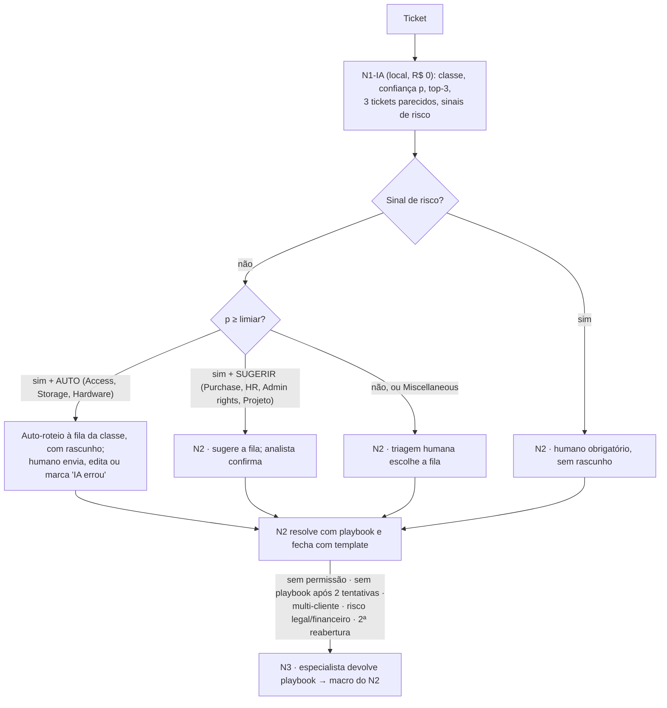

# Proposta — triagem N1-IA → N2 → N3 com gate de confiança

Hugo Cunha · Challenge 002 · 2026-09-16 · Números: `prototipo/artifacts/metrics.json` (hold-out de 9.481 tickets reais do Dataset 2, traduzidos para pt-BR), `policy.json`, `ds1_metrics.json`; premissas rotuladas.

**Tese.** Automatiza-se hoje, com prova, a triagem: um classificador local roteia sozinho os tickets em que a precisão medida é ≥ 97% e devolve o resto a uma pessoa; a resolução assistida por similaridade depende antes do fechamento padronizado. Regra inegociável, no texto e no código: **a IA nunca responde ao cliente nem fecha ticket.**

## 1. O fluxo

## 2. O limiar, em linguagem de gestor

O classificador devolve, por ticket, a probabilidade (calibrada: ECE 0,035) de a classe prevista estar certa; o limiar é a confiança mínima para a IA agir sozinha (`thresholds`; `prototipo/artifacts/figures/coverage_accuracy.png`):

| Limiar | Cobertura bruta | Acerto bruto | Cobertura útil | Acerto útil | Erros úteis | Tickets/mês auto-roteados* |
|---:|---:|---:|---:|---:|---:|---:|
| 0,80 | 62,2% | 96,4% | 31,5% | 96,1% | 117 em 2.990 | ~790 (~31 erros) |
| **0,90** | 49,3% | 98,1% | **24,8%** | **98,0%** | **47 em 2.352** | ~620 (~12 erros) |
| 0,95 | 39,9% | 98,9% | 19,7% | 98,9% | 21 em 1.865 | ~490 (~6 erros) |

"Útil" = p ≥ limiar **e** classe auto-roteável **e** sem sinal de risco (1,2% do hold-out tem sinal). \*Premissa: 2.500 tickets/mês (30.000/ano do brief). Recomendação: piloto em **0,90** (o seletor do Board oferece 0,80 / 0,90 / 0,95); afrouxar para 0,80 depois do modo sombra se "IA errou" ficar abaixo do re-roteamento humano atual. O limiar não muda o bloco de baixa confiança (37,8% dos tickets, p < 0,80) que acerta só 65,0% e é humano em qualquer cenário.

## 3. Política por classe

Cobertura e acerto a 0,90 dentro de cada classe prevista (`per_class_at["0.90"]`), volume após desduplicação (`class_counts`), ação e motivo (`policy.json`). Na tela, classes em português (Acesso, Armazenamento…); na API, chaves em inglês.

| Classe (volume) | Cobertura a 0,90 | Acerto | Ação | Motivo |
|---|---:|---:|---|---|
| Access (7.098) | 59,7% | 98,7% | auto-roteio com rascunho | pedido repetitivo e de alta precisão; rotear não concede acesso |
| Storage (2.772) | 67,9% | 99,4% | auto-roteio com rascunho | melhor precisão entre as classes auto-roteáveis; aumento de cota é decisão do N2 |
| Hardware (13.573) | 41,0% | 97,2% | auto-roteio com rascunho | troubleshooting padronizável; classe que absorve confusões, primeira a ter kill switch |
| Purchase (2.275) | 86,0% | 99,4% | sugerir fila | envolve dinheiro e aprovação: N2 confirma a fila |
| HR Support (10.797) | 48,1% | 98,6% | sugerir fila | envolve pessoas: nunca rascunho automático |
| Administrative rights (1.756) | 39,6% | 98,1% | sugerir fila | elevação de privilégio é segurança e é a classe que o modelo menos reconhece (recall 0,67) |
| Internal Project (2.106) | 60,8% | 97,7% | sugerir fila | não é suporte; vai ao PMO com confirmação |
| Miscellaneous (7.024) | 40,7% | 97,1% | sempre humano | classe 'não sei' por definição: sempre humano |

Três tickets reais em que o modelo erra com confiança ≥ 0,99 (`holdout_pred.csv.gz`; texto como está no corpus traduzido), um por saída do gate:

- **id 42996** — "não pode entrar no laptop chamado aconselhado ela não pode entrar em seu laptop": previsto Hardware, p = 0,993; verdadeiro Access. Vai à fila Hardware com rascunho errado; o analista clica "IA errou" e o ticket volta a N2-triagem. Dos 47 erros úteis a 0,90, 35 entram pela fila Hardware (10 são Administrative rights e 7 são Access lidos como Hardware): por isso Hardware tem o primeiro kill switch.
- **id 41631** — "conectar o estagiário para o Outlook conectar estagiário": previsto Administrative rights, p = 0,999; verdadeiro HR Support (integração de estagiário). A IA leu "conectar ao Outlook" como privilégio; como Administrative rights está em "sugerir", o ticket chega ao N2 com a fila sugerida, sem rascunho, e o analista corrige em um clique. Errar custa uma confirmação, não uma fila errada.
- **id 26466** — "mailing list info belgrade por favor adicione mailing": previsto Miscellaneous, p = 0,993; verdadeiro HR Support. "Não sei" com 99% de confiança é o motivo de Miscellaneous nunca contar como roteado: vai a N2-triagem e a pessoa escolhe a fila, como hoje.

## 4. Fechamento padronizado, retro-padronização e similaridade

> **Decisão humana (Hugo).** Nenhum dos datasets tem "como foi resolvido" de forma utilizável, e a operação real costuma não ter também; sem fechamento padronizado não há base de conhecimento nem similaridade que valha uma tratativa. Regra de processo: **o ticket não fecha na ferramenta atual sem o template preenchido.**

Obrigatórios: categoria (8 classes), subcategoria, causa raiz, ação de resolução passo a passo (≥ 20 caracteres), nível que resolveu (N1-IA/N2/N3), tempo gasto, reutilizável?, reaberto?; opcionais: resposta enviada, artigo de base, satisfação 1–5, produto, tags; configurados na ferramenta que a operação já usa (a aba Fechamento padronizado do protótipo ilustra). **Retro-padronização**: um LLM lê os fechamentos legados e preenche o template, com amostra revisada por pessoas; para 30.000 fechamentos legados (volume anual do brief) com Haiku 4.5, a premissa de ~1.000 tokens por ticket dá dezenas de dólares.

**Similaridade hoje (real, nos cards do board)**: os 3 tickets de treino mais parecidos, com classe e similaridade, como evidência ao N2 e para agrupar alertas repetidos; medido (`similarity`), o 1-NN concorda com o rótulo em 68,3% (classificador: 84,5%), ≥ 0,90 cobre 1,2% (93,9% de concordância) e ≥ 0,70 cobre 9,4% (92,3%). **Depois de 30 dias de fechamentos padronizados (conceito; a tela ilustrativa saiu do protótipo na rodada 2, por decisão do Hugo: painel para operação, não para avaliador)**: os mesmos 3 com o template preenchido e o botão "Aplicar tratativa sugerida", habilitado só com similaridade ≥ 0,90 **e** classe AUTO **e** entrada "reutilizável"; o humano ainda envia. A curva (`prototipo/artifacts/figures/similarity_curve.png`) corrige a minha proposta inicial: a decisão é do classificador; a similaridade prepara.

## 5. Adoção, KPIs e o que NÃO automatizar

1. **Modo sombra (2–4 semanas)**: a IA só sugere; medem-se aceitação e reabertura por classe, o re-roteamento humano atual vira baseline, kappa de 200 tickets entre 2 triadores.
2. **Liberação por classe**: auto-roteio com ≥ 95% de aceitação em 200 sugestões e reabertura ≤ a do N2; kill switch por classe.
3. **Resposta automática** só nas classes liberadas, ainda com fechamento humano; auditoria cega semanal.

KPIs: no protótipo (REAL), tickets recebidos, % tratados pela IA (N1-IA), % delegados ao humano (N2), % escalados ao N3 ("por escalação humana"), acerto da IA no bloco tratado, overrides "IA errou"; **TMA por nível N1-IA / N2 / N3 medido no board**, o tempo médio que o card ficou em cada coluna nesta sessão (selo MEDIDO NO BOARD). Em produção, aceitação e edição por classe, reabertura em 7 dias por nível, roteamento errado, escalação N2→N3, FCR, CSAT e TMA por nível a partir do log do helpdesk. Os datasets não permitem TMA histórico.

Nunca automatizar: **responder ao cliente, fechar ticket, conceder acesso ou privilégio** (o rótulo da IA não dispara provisionamento); **HR Support** (pessoas), **Purchase** e, do Dataset 1, Refund, Cancellation e Billing (dinheiro, retenção, atendimento humano obrigatório); **Miscellaneous** (5,9% do hold-out iria "com confiança" para lá); **qualquer sinal de risco**; **o bloco de baixa confiança** (37,8% com p < 0,80). A IA detecta e prioriza; a pessoa atende.

## 6. Custo de API e ROI paramétrico

Classificação e similaridade são locais: R$ 0 por ticket, 25 MB de modelo, 109 s de treino; o LLM só entraria no rascunho. Premissas: 2.500 tickets/mês, preços de lista lidos em 16/09/2026, câmbio R$ 5,15.

| Cenário | Modelo | US$/mês | R$/ano | R$/ticket |
|---|---|---:|---:|---:|
| A (recomendado): local + LLM só no rascunho, ~50% dos tickets | Haiku 4.5 | ~3,4 | ~210 | 0,007 |
| B: LLM em 100% dos tickets | Haiku 4.5 | ~6,8 | ~420 | 0,014 |
| C: agente com reclassificação | Haiku 4.5 | ~20 | ~1.200 | 0,04 |

Sonnet ~2× e Opus ~5× o Haiku; GPU própria, R$ 13,6–17,1 mil/ano. O custo de IA é ruído; o custo real é hora de N2. **ROI**: `horas = V·c·m_t + V·(1−c)·(m_t − m_s) − V·c·e·m_e`, com **c = 24,8%** e **e = 2,0%** medidos (cobertura e erro úteis a 0,90); premissas: V = 2.500 tickets/mês, m_t = minutos da triagem manual, m_s = da triagem assistida, m_e = minutos para desfazer um erro, custo-hora R$ 41 (CBO 212420, R$ 4.066 × 1,7 de encargos). Conta do cenário base: 2.500 × 0,248 × 3 = 1.860 min, mais 2.500 × 0,752 × (3 − 2) = 1.880 min, menos 2.500 × 0,248 × 0,020 × 12 = 149 min → 3.591 min ≈ 60 h/mês × R$ 41 ≈ R$ 2,5 mil/mês ≈ R$ 29 mil/ano; os outros dois cenários seguem a mesma conta.

| Cenário (todos: premissa do autor, substituir pelos números do helpdesk) | m_t | m_s | m_e | Horas/mês | R$/mês | R$/ano |
|---|---:|---:|---:|---:|---:|---:|
| Pessimista: a assistência não poupa nada fora da fatia automática | 2 | 2 | 15 | ~18 | ~0,7 mil | ~8,6 mil |
| Base | 3 | 2 | 12 | ~60 | ~2,5 mil | ~29 mil |
| Otimista | 4 | 2 | 10 | ~102 | ~4,2 mil | ~50 mil |

O erro pesa pouco (15 min por erro custam 0,3 min por ticket coberto); o que decide é m_s, que só a amostra cronometrada do diagnóstico mede. O painel não faz esta conta. A triagem vale uma fração de uma pessoa: é o sensor que cria rótulo, confiança e log de re-roteamento; AHT, deflexão e retenção não são mensuráveis com estes dados.

## 7. Limitações

- Dataset 1 sem tempo nem satisfação reais; Dataset 2 sem resolução, de TI e **traduzido automaticamente** para pt-BR (tradução telegráfica, formas pt-PT e pt-BR misturadas; −2 p.p. de acurácia: 86,5% em inglês → 84,5%): a transferência do gate para a operação do G4 é premissa; o modelo é descartável (retreinar no histórico em português da empresa, sem tradução).
- O gate calibrado só vale com a mesma normalização; texto fora do domínio deve sair com baixa confiança e ir a N2.
- A cobertura útil a 0,90 (24,8%) fica 0,8 p.p. acima do piso do teste (24%) e oscila com hiperparâmetros, seed e tradução; todo número vem de um único `make train`.
- A acurácia humana da triagem não foi medida; se as pessoas acertam ~88%, o pitch vira "melhora o roteamento".
- Sinais de risco são regex conservadoras: "cancel" no Dataset 2 quase sempre é "cancelar o incidente" (id 293, um cartão de acesso reencontrado com "cancele" o chamado, vai a humano obrigatório com p = 0,98), um falso positivo que custa uma triagem.
- Sem drift, retreino ou feedback loop demonstrados; rascunhos por macro (LLM desligado); chegada e responsáveis simulados e rotulados; o TMA por nível medido no board é o da sessão de demonstração, não o da operação.
